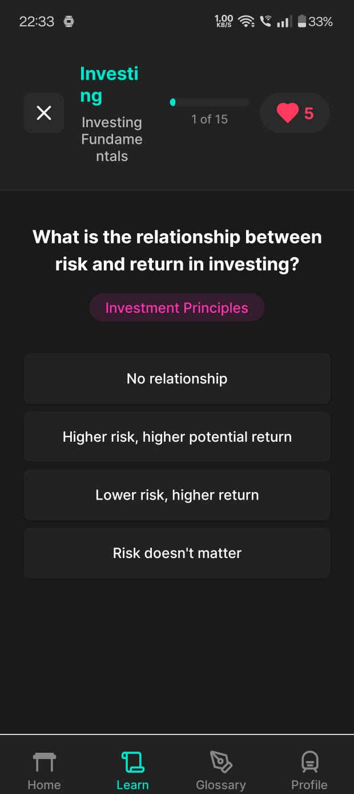
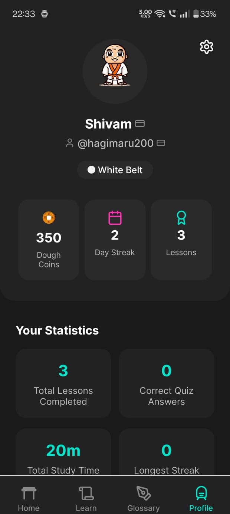

#  DoughJo: Level Up Your Money Game


---

**DoughJo** is a gamified, mobile-first financial education app. Learn essential money skills through interactive lessons, quizzes, and challenges. Earn rewards, track your progress, and master your finances with the guidance of DoughJo Sensei!

---

🔗 [Download APK](https://github.com/Shivam007kumar/doughjo.app/releases/latest)

---
## 🚀 Features

- **Bite-sized Lessons:** Learn budgeting, saving, investing, credit, and more.
- **Interactive Quizzes & Challenges:** Test your knowledge and apply skills in real-life scenarios.
- **Progress Tracking:** Streaks, XP, badges, and belt progression.
- **Glossary:** In-app financial terms explained simply.
- **Rewards System:** Earn Dough Coins and achievements.
- **Beautiful Animations:** Engaging UI with custom illustrations and sound effects.
- **Personalized Learning:** Adaptive recommendations and user progress tracking.

---

## 📸 Screenshots

| Onboarding | Lesson | Quiz | Profile |
|-----------|--------|------|---------|
|  |  |  |  |

---

## 🛠️ Getting Started

### Prerequisites
- [Node.js](https://nodejs.org/) (v18+ recommended)
- [Yarn](https://yarnpkg.com/) or npm
- [Expo CLI](https://docs.expo.dev/get-started/installation/)

### Installation

```bash
# Clone the repo
$ git clone <your-repo-url>


# Install dependencies
$ npm install
# or
$ yarn install
```

### Running the App

```bash
# Start the Expo development server
$ npm start
# or
$ yarn start
```

- Scan the QR code with the Expo Go app on your device, or run on an emulator.

---

## 🗂️ Project Structure

```
beta/
├── app/                # App entry, screens, API routes
│   ├── (auth)/         # Authentication screens (login, signup, username)
│   ├── (tabs)/         # Main app tabs (home, learn, glossary, profile)
│   ├── api/            # API endpoints (lessons, user progress)
│   ├── challenge/      # Challenge screens
│   ├── lesson/         # Lesson screens
│   └── onboarding.tsx  # Onboarding flow
├── assets/             # Images and sounds
├── components/         # Reusable UI components
├── constants/          # Theme, colors, lessons, glossary
├── contexts/           # React context providers
├── hooks/              # Custom React hooks
├── lib/                # External libraries (e.g., Supabase)
├── types/              # TypeScript types
├── utils/              # Utility functions
└── ...
```

---

## 🧩 Core Technologies

- **React Native** (Expo)
- **TypeScript**
- **Expo Router**
- **Supabase** (for backend/auth)
- **React Navigation**
- **Lucide Icons**
- **Reanimated** (animations)

---

## 🏗️ Key Components & Architecture

- **AuthContext:** Handles authentication and user sessions.
- **LessonManager:** Fetches and manages lessons and user progress.
- **QuizCard, LessonCard, ProgressBadge:** Modular UI for learning and gamification.
- **DoughJoLoadingScreen:** Animated loading and transitions.
- **Custom Hooks:**
  - `useLessonManager`, `useUserProgress`, `useAchievements`, `useDailyQuiz`, `useSound`
- **API Endpoints:**
  - `/api/lessons` — Fetch lessons
  - `/api/lesson-content` — Lesson content
  - `/api/user-progress` — Track user progress

---

## 📚 Glossary Example

| Term                | Description                                                                 |
|---------------------|-----------------------------------------------------------------------------|
| **Budget**          | A financial plan for a defined period, showing income and expenses.          |
| **Emergency Fund**  | Money set aside for unexpected expenses or emergencies.                      |
| **Credit Score**    | A number representing your creditworthiness.                                 |
| **Compound Interest** | Interest calculated on both the principal and accumulated interest.         |
| **Diversification** | Spreading investments to minimize risk.                                      |

*See the in-app Glossary for more!*


## 🤝 Contributing

1. Fork the repo
2. Create your feature branch (`git checkout -b feature/YourFeature`)
3. Commit your changes (`git commit -m 'Add some feature'`)
4. Push to the branch (`git push origin feature/YourFeature`)
5. Open a Pull Request


---
## 📄 License

MIT

---

> Made with ❤️ by the DoughJo Team • Powered by [Bolt](https://bolt.new/)

